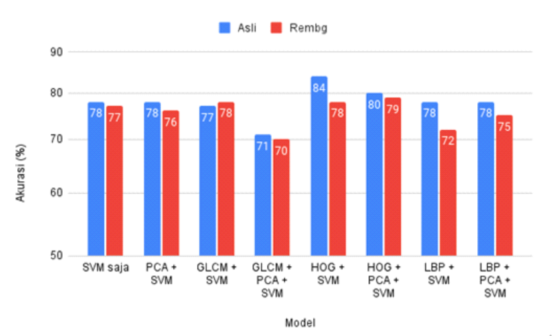

# Waste Image Classification using Support Vector Machine Algorithm

## Abstract

The problem of waste accumulation is worsening. In fact, the World Bank
(2018) predicted that waste will increase by 70% in 2050. One of the ways to
address this is by sorting and recycling waste. However, the accumulation of waste
at landfill sites renders conventional sorting processes ineffective. In order to help
address this issue, this research implemented image-based waste classification on
the TrashNet dataset. There were a total of 2527 images across six classes, which
were then divided into three classes: landfill, paper, and recyclable. For comparison,
a new dataset was created by removing the background from each image using
Rembg. The absence of background meant that only the object part was retained.

The experiments conducted involve comparing results with and without
feature extraction using Gray Level Co-Occurence Matrix (GLCM), Histogram of
Oriented Gradients (HOG), and Local Binary Pattern (LBP), as well as with and
without dimensionality reduction using Principal Component Analysis (PCA).
Features generated from the original data and Rembg data became input into the
Support Vector Machine (SVM) classifier. The best classification result was
achieved by HOG features on the original data with an accuracy of 84%. For the
same features, Rembg data only reached 78% accuracy, with its best accuracy being
79% using HOG and PCA features. Upon further examination, misclassified images
in the HOG features set showed that similar image shapes across classes and the
content or information on the objects affected accuracy. Looking at the overall
experiments, Rembg data did not outperform the original data, with lower accuracy
in seven out of eight models. This indicated that the absence of background did not
necessarily improve SVM's ability to differentiate objects in images.

Key Words: Waste, Rembg, Gray Level Co-Occurence Matrix, Histogram of Oriented Gradients, Local Binary Pattern, Principal Component Analysis Support Vector Machine

## Features

- Implemented SVM for waste image classification using the TrashNet dataset.
- Utilized various feature extraction techniques, including: PCA, GLCM, HOG, LBP.
- Compared multiple model configurations: SVM with PCA, SVM with GLCM, HOG, and LBP, both with and without PCA.

## Dataset

This project used the TrashNet dataset with six classes: glass, paper, cardboard, plastic, metal, and trash. The dataset consists of 2527 images. For this project the dataset was divided into three classes only: landfill, paper, and recyclable.

Then a new sets of data was created using [Rembg library](https://github.com/danielgatis/rembg) by Daniel Gatis to remove backgrounds from all of the images in TrashNet. When using Rembg, there was challenges when it came to TrashNet's images:
- Some of the images are not capturing the whole object (e.g. cropped). It led to Rembg failing to retain the object.
- The object's shadow are visible in some of the images. It led to the shadow being perceived as a part of the object by Rembg.
To overcame this problem, the images considered as fail were removed from the dataset. In the end, the Rembg dataset consists of 

The original dataset used in this project:
[TrashNet Dataset](https://github.com/garythung/trashnet)

While the dataset consists of images with background removed could be found on Kaggle:
[TrashNet Rembg Dataset](https://kaggle.com/datasets/5b2ee735da96d15fef51c812fd68bd7945a92765639f54126bde2af9773090bf)

## Methodology

1. Preprocessing
   - Images were converted to grayscale and resized for consistency.
   - Background removal was performed on the images using the Rembg library to create new sets of data.
2. Feature Extraction
   - GLCM: Extracted texture features based on pixel intensity relationships.
   - HOG: Captured fradient and edge information for object recognition.
   - LBP: Extracted local texture patterns from images.
   - PCA: Reduced dimensionality by selecting the most significant components.
3. Model Training
   - Models were trained using SVM with different combinations of feature extraction techniques.
   - Grid Search Cross-Validation was used to tune hyperparameters (C, gamma, kernel) for optimal performance.

## Results

The bar chart below shows the accuracy comparison between eight different models applied to the dataset. The blue bars represent the accuracy using the original images, while the red bars indicate the accuracy achieved after applying background removal using the rembg tool.

Despite the common expectation that background removal would improve classification performance, the results reveal mixed outcomes. For some models, the accuracy decreases after background removal, highlighting the importance of texture and contextual information in object classification. Below is a breakdown of the results:
- SVM: Accuracy with original images is 78%, while with background removal, it remains at 78%.
- PCA + SVM: Background removal slightly reduces the accuracy, from 79% to 77%.
- GLCM + SVM: The accuracy drops from 78% to 73% after removing the background.
- GLCM + PCA + SVM: Similar results with a slight drop from 78% to 76%.
- HOG + SVM: This model shows an increase in accuracy, from 80% to 84%, after applying background removal.
- HOG + PCA + SVM: The performance remains nearly the same, at 79% and 80%, respectively.
- LBP + SVM: The accuracy decreases from 78% to 72% with background removal.
- LBP + PCA + SVM: The accuracy remains at 75%, showing stability despite background removal.

## Disclaimer

This project was part of my undergraduate thesis and contains code that was adapted from various sources with modifications. It is intended for educational purposes and as a portfolio item to showcase the approach taken to complete the thesis. The code may not be fully optimized or original.
